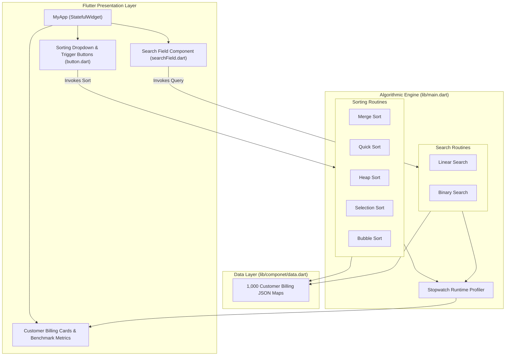

# Electricity Billing System: Search & Sorting Algorithm Benchmarking (Flutter)

A cross-platform Flutter application engineered to demonstrate, benchmark, and visualize the empirical execution time performance of fundamental **Searching and Sorting Algorithms** against a real-world dataset of 1,000 utility customer electricity billing records.

---

## Features

- **Empirical Algorithm Benchmarking**:
  - High-precision runtime measurement utilizing Dart's `Stopwatch` class to calculate and display elapsed execution durations down to the millisecond/microsecond level.
  - Direct comparative evaluation between asymptotically optimal algorithms ($O(n \log n)$ and $O(\log n)$) and naive implementations ($O(n^2)$ and $O(n)$).
- **Sorting Algorithms Implemented**:
  1. **Merge Sort** — $O(n \log n)$ divide-and-conquer recursive sorting.
  2. **Quick Sort** — $O(n \log n)$ partition-based recursive sorting.
  3. **Heap Sort** — $O(n \log n)$ binary heap tree-based sorting.
  4. **Selection Sort** — $O(n^2)$ linear scanning and minimum element placement.
  5. **Bubble Sort** — $O(n^2)$ adjacent element comparison and swapping.
- **Searching Algorithms Implemented**:
  1. **Binary Search** — $O(\log n)$ logarithmic search over sorted customer arrays.
  2. **Linear Search** — $O(n)$ sequential search over unsorted customer records.
- **Utility Billing Data Model**:
  - Contains 1,000 structured customer records with the following schema:
    - Customer Name (`اسمالعميل`)
    - Account Number (`رقمالحساب`)
    - Apartment Number (`رقمالشقة`)
    - Electricity Consumption in kWh (`استهلاكالكهرباء`)
    - Invoice Total Due in EGP (`قيمةالفاتورة`)
    - Due Date (`تاريخالاستحقاق`)
    - Payment Status (`حالةالدفع`: "مسددة" / Paid, "غير مسددة" / Unpaid)
- **Interactive UI**:
  - Real-time customer search query bar, algorithm selector dropdowns, execution metric cards, and a paginated customer ledger.

---

## Computational Complexity & Performance Summary

| Algorithm | Type | Best Case | Average Case | Worst Case | Space Complexity |
|---|---|---|---|---|---|
| **Binary Search** | Search | $O(1)$ | $O(\log n)$ | $O(\log n)$ | $O(1)$ |
| **Linear Search** | Search | $O(1)$ | $O(n)$ | $O(n)$ | $O(1)$ |
| **Merge Sort** | Sorting | $O(n \log n)$ | $O(n \log n)$ | $O(n \log n)$ | $O(n)$ |
| **Quick Sort** | Sorting | $O(n \log n)$ | $O(n \log n)$ | $O(n^2)$ | $O(\log n)$ |
| **Heap Sort** | Sorting | $O(n \log n)$ | $O(n \log n)$ | $O(n \log n)$ | $O(1)$ |
| **Selection Sort** | Sorting | $O(n^2)$ | $O(n^2)$ | $O(n^2)$ | $O(1)$ |
| **Bubble Sort** | Sorting | $O(n)$ | $O(n^2)$ | $O(n^2)$ | $O(1)$ |

---

## Application Architecture



---

## Project Structure

```text
Searching-Sorting-Algorithm/
├── lib/
│   ├── componet/
│   │   ├── button.dart                 # Custom button components for algorithm selection
│   │   ├── data.dart                   # 1,000 utility customer electricity invoice records
│   │   └── searchField.dart            # Search bar input text widget
│   └── main.dart                       # Sorting algorithms, search routines, and benchmark UI
├── test/
│   └── widget_test.dart                # Widget test file
├── IMG_20240504_234056.jpg to ...251.jpg# Screenshots of search results & benchmark times
├── Record_2024-05-04-05-22-09.mp4       # Video demonstration of live runtime benchmarking
└── README.md
```

---

## Application Screenshots

| Invoice Search & Record View | Sorting Benchmark Timings |
|---|---|
|  |  |

| Filtered Customer View | Paid / Unpaid Status Filter |
|---|---|
|  |  |

| Execution Comparison | Metric Diagnostics |
|---|---|
|  |  |

---

## Installation & Running

### Prerequisites
- [Flutter SDK](https://docs.flutter.dev/get-started/install) (3.x or higher)
- Android Studio, VS Code, or Xcode (for macOS/iOS targets)

### Setup & Launch
1. Clone the repository:
   ```bash
   git clone https://github.com/Eng-Ghanem/Searching-Sorting-Algorithm.git
   cd Searching-Sorting-Algorithm
   ```

2. Fetch dependencies:
   ```bash
   flutter pub get
   ```

3. Launch on desktop or connected mobile emulator:
   ```bash
   # Run on Chrome
   flutter run -d chrome

   # Run on Windows Desktop
   flutter run -d windows
   ```

---

## Video Demonstration

A complete walkthrough showing live execution speed comparisons between Linear vs. Binary search and $O(n \log n)$ vs. $O(n^2)$ sorts is available in [`Record_2024-05-04-05-22-09.mp4`](Record_2024-05-04-05-22-09.mp4).

---

## Author

- **Mohamed Ghanem** - [Eng-Ghanem](https://github.com/Eng-Ghanem)
